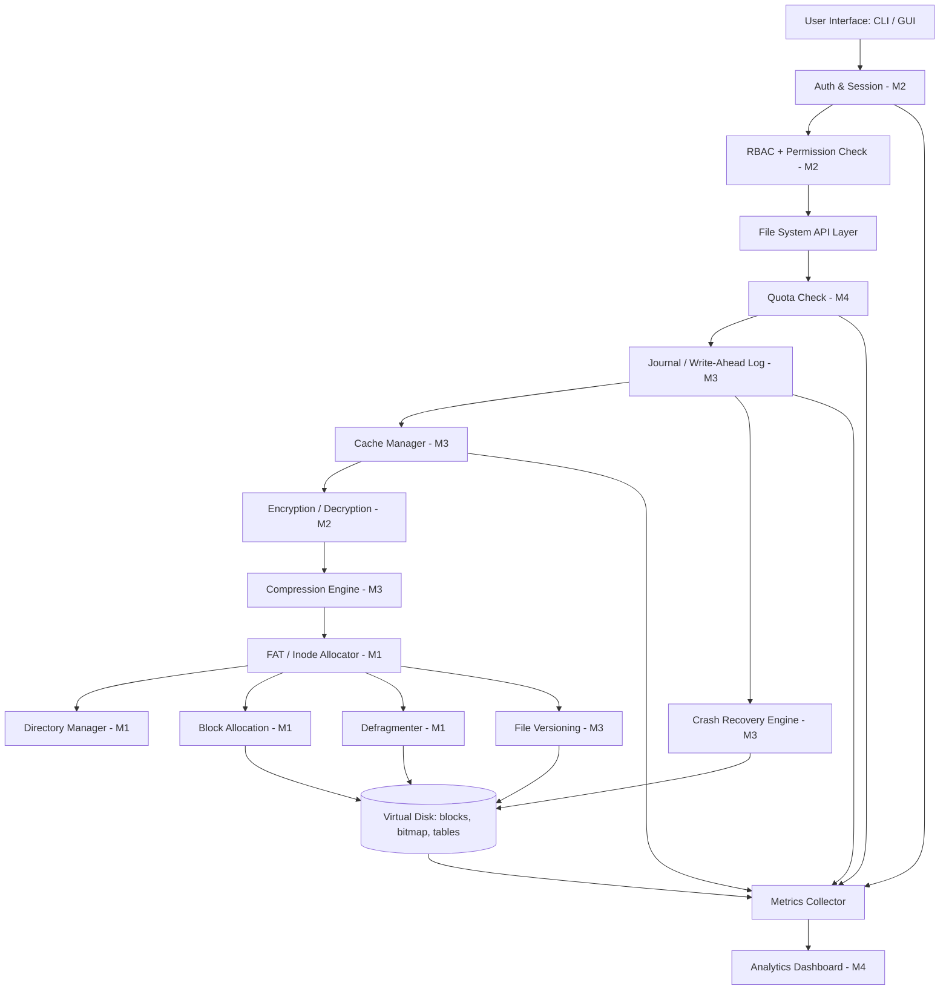
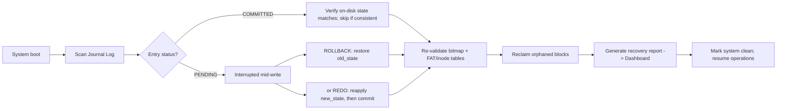

# SmartFS — System Architecture

## 1. Purpose, Scope, and Non-Goals

SmartFS simulates the request path of a real file system: from a user command,
through access control, through the durability and caching layer, down to raw
block storage — with an analytics layer observing every stage.

**Goals**
- Demonstrate real OS storage concepts (allocation, journaling, caching,
  recovery, RBAC, encryption, quotas) with working, testable code.
- Keep the four subsystems (M1–M4) *independently developable* against a fixed
  set of interface contracts, and *independently testable* in isolation.
- Make every ordering decision in the pipeline explicit and justified (§9),
  because in a layered system the order of operations *is* the architecture.

**Non-goals**
- SmartFS does not aim for POSIX compliance, multi-process concurrency at OS
  scheduler granularity, or production-grade cryptographic hardening. It aims
  to be a faithful, inspectable teaching model of these subsystems.

## 2. Layered Architecture

Requests flow top-down; data, status, and errors flow bottom-up. The Analytics
layer is **not** in the critical path — it listens to events emitted by every
other layer rather than being polled synchronously (this is deliberate; see §9).

```
┌─────────────────────────────────────────────────────────────────┐
│ LAYER 1 — USER INTERFACE                                         │
│   CLI / GUI: login, file browser, admin panel                    │
└──────────────────────────────┬────────────────────────────────────┘
                                │ user command (verb + args + session)
┌──────────────────────────────▼────────────────────────────────────┐
│ LAYER 2 — SECURITY & ACCESS CONTROL (M2)                          │
│   Authentication → Session/Token → RBAC Check → Permission Bits   │
└──────────────────────────────┬────────────────────────────────────┘
                                │ authorized request
┌──────────────────────────────▼────────────────────────────────────┐
│ LAYER 3 — FILE SYSTEM API / SYSCALL LAYER (owned by M4 in         │
│   coordination with all modules — the single point every op       │
│   passes through)                                                  │
│   create() · open() · read() · write() · delete() · mkdir()       │
└─────────────┬──────────────────────────────────┬───────────────────┘
              │                                  │
┌─────────────▼────────────────────┐  ┌──────────▼──────────────────┐
│ LAYER 4A — RELIABILITY (M3)      │  │ LAYER 4B — STORAGE ENGINE    │
│   Journal (WAL) → Cache (LRU) →  │  │   (M1)                       │
│   Compression → Versioning       │  │   FAT / Inode Allocator →    │
│                                   │  │   Directory Mgmt →           │
│                                   │  │   Block Allocation →         │
│                                   │  │   Defragmenter                │
└─────────────┬─────────────────────┘  └──────────┬───────────────────┘
              │                                  │
              └────────────────┬─────────────────┘
                                │ physical block I/O
┌──────────────────────────────▼────────────────────────────────────┐
│ LAYER 5 — VIRTUAL DISK STORAGE                                     │
│   Superblock | Free-Block Bitmap | FAT/Inode Table | Data Blocks   │
└──────────────────────────────┬────────────────────────────────────┘
                                │ raw metrics & events (async, non-blocking)
┌──────────────────────────────▼────────────────────────────────────┐
│ LAYER 6 — ANALYTICS & MONITORING DASHBOARD (M4)                    │
│   Disk usage · Fragmentation · Cache hit ratio · Quotas ·          │
│   Access logs · Journal/recovery events                            │
└─────────────────────────────────────────────────────────────────────┘
```

### Layer responsibilities

| Layer | Responsibility | Fails closed on |
|---|---|---|
| 1. UI | Parse commands, hold nothing security-sensitive in plaintext beyond the session | N/A |
| 2. Security | Every request is *proven* authorized before layer 3 sees it | Expired token, wrong role, denied permission bits |
| 3. API/Syscall | Single funnel — no module reaches layer 5 except through here | Malformed args, unknown path |
| 4A. Reliability | Guarantees durability and consistency of what layer 4B does | Journal write failure, cache corruption |
| 4B. Storage Engine | Owns the physical layout and allocation truth | Disk full, broken chain, orphaned block |
| 5. Virtual Disk | The ground truth on-disk state | Bitmap/FAT mismatch (caught by recovery, §6) |
| 6. Analytics | Observability only — never blocks or mutates state | N/A (best-effort) |

## 3. Component Diagram



## 4. Core Data Structures (Layer 5) — Summary

> Full field-level definitions live in `design.md §2`. This is the architectural
> summary of *what exists on disk* and *why*.

| Structure | Purpose | Mutated by |
|---|---|---|
| Superblock | Disk size, block size, total/free block count, allocation mode | M1 (format-time), read by all |
| Free-Block Bitmap | 1 bit per block: free or allocated | M1 (allocate/free), verified by M3 recovery |
| FAT Table | block → next block in chain (or EOF) | M1 (FAT mode only) |
| Inode Table | owner, permissions, size, timestamps, block pointers | M1 (Inode mode), M2 (permission bits) |
| Directory Entries | filename → inode number / starting cluster | M1 |
| Journal Log | append-only `{op_type, target, old_state, new_state, status}` | M3 |
| Version Store | per-file `{version_id, timestamp, block_map/diff}` | M3 |

## 5. Pipeline A — Write Operation (End-to-End)

The **canonical request path**. Every step's position is load-bearing (§9
explains why each ordering choice exists).

```mermaid
sequenceDiagram
    participant UI
    participant M2 as Auth/RBAC (M2)
    participant M4Q as Quota (M4)
    participant M3J as Journal (M3)
    participant M3C as Compress (M3)
    participant M2E as Encrypt (M2)
    participant M1 as Allocator (M1)
    participant Disk as Virtual Disk
    participant M3Cache as Cache (M3)
    participant M3V as Versioning (M3)
    participant M4M as Metrics (M4)

    UI->>M2: write(file, data, session)
    M2->>M2: validate session, reject if expired
    M2->>M2: RBAC role check + permission bits check
    M2->>M4Q: authorized request
    M4Q->>M4Q: usage + incoming size vs limit; reject if over
    M4Q->>M3J: write intent {op:WRITE, file, offset, size, status:PENDING}
    M3J->>Disk: flush journal entry BEFORE touching real data
    M3J->>M3C: compress(data)
    M3C->>M2E: encrypt(compressed)
    M2E->>M1: allocate blocks for encrypted+compressed payload
    M1->>M1: find free clusters/blocks, update bitmap
    M1->>Disk: physical write; update FAT/inode + directory entry
    M1->>M3Cache: insert/update LRU cache
    M1->>M3V: snapshot new version entry
    M1->>M3J: mark journal record COMMITTED
    M3J->>M4M: emit disk usage, cache stats, journal event
    M4M-->>UI: success/failure
```

1. **User Interface** → sends `write(file, data, user_session)`
2. **Authentication (M2)** — validate session/token; reject if expired/invalid
3. **RBAC + Permission Check (M2)** — confirm role allows "write"; confirm file's
   rwx bits (owner/group/others) allow write; reject with `PermissionDenied`
4. **Quota Check (M4)** — current usage + incoming size vs. limit; reject with
   `QuotaExceeded` if over
5. **Journaling — Pre-Commit (M3)** — write intent record
   `{op: WRITE, file, offset, size, status: PENDING}`; **flush to disk before
   touching real data**
6. **Compression (M3)** — compress incoming block(s)
7. **Encryption (M2)** — encrypt the *compressed* data with the file/user key
8. **Block Allocation (M1)** — FAT: find free clusters, link chain / Inode: find
   free blocks, update inode pointers; update free-block bitmap
9. **Physical Write (Layer 5)** — write encrypted+compressed blocks; update
   FAT/inode table and directory entry
10. **Cache Update (M3)** — insert/update written blocks in LRU cache
11. **Versioning (M3)** — snapshot new version entry
12. **Journaling — Commit (M3)** — mark journal record `COMMITTED`
13. **Metrics Emit (M4)** — push updated usage, cache stats, journal event
14. **Response** — return success/failure to UI

## 6. Pipeline B — Read Operation

1. UI requests `read(file, user_session)`
2. Auth (M2) validates session
3. RBAC/permission check (M2) confirms read access
4. Cache Manager (M3) checks LRU cache — **HIT**: serve directly, update
   hit-ratio metric — **MISS**: continue to disk
5. Storage Engine (M1) locates blocks via FAT/inode chain
6. Blocks read from Virtual Disk (Layer 5)
7. Decryption (M2) using file/user key
8. Decompression (M3)
9. Cache updated with newly fetched blocks
10. Metrics emitted (M4): cache hit/miss, access log entry
11. Data returned to UI

## 7. Pipeline C — Crash Recovery (Startup Sequence)



1. System boot / simulator restart
2. Recovery Engine (M3) scans the Journal Log
3. For each entry:
   - `COMMITTED` → verify on-disk state matches; skip if consistent
   - `PENDING` → operation was interrupted mid-write:
     - **ROLLBACK**: restore `old_state` from the journal, **or**
     - **REDO** (if using redo-logging): reapply `new_state`, then commit
4. Free-block bitmap and FAT/inode tables re-validated for consistency
5. Orphaned blocks (allocated but unreferenced) are reclaimed
6. Recovery report generated → sent to Analytics Dashboard (M4)
7. System marked "clean" → normal operations resume

**Design commitment:** SmartFS uses **undo (rollback) logging** as the default
recovery strategy — the journal stores `old_state`, and any `PENDING` entry at
restart is unwound rather than replayed forward. This is simpler to reason about
for a semester project than redo-logging with idempotent replay, at the cost of
losing the in-flight write (acceptable: the client never received a success
response for it). See `design.md §5` for the alternative and its trade-offs.

## 8. Pipeline D — Defragmentation (Background/On-Demand)

1. Defragmenter (M1) scans FAT/inode chains for non-contiguous blocks
2. Fragmentation % calculated → reported to Dashboard (M4)
3. If triggered (manually or by threshold):
   1. Journal (M3) logs the defrag operation as a transaction
   2. Fragmented file's blocks are read into memory
   3. Contiguous free blocks are allocated
   4. Data rewritten contiguously
   5. FAT/inode pointers and directory entries updated
   6. Old blocks freed in bitmap
   7. Journal marks defrag transaction `COMMITTED`
4. Updated fragmentation metric pushed to Dashboard

Defrag is journaled exactly like a write — a crash mid-defrag must be as
recoverable as a crash mid-write. Treat it as a first-class transaction, not a
"maintenance script" exempt from the durability rules.

## 9. Why This Order of Operations Matters

- **Auth/RBAC before everything** — no unauthorized request should ever reach
  the storage engine, even to *fail* there. A permission check that happens
  after allocation has already leaked side effects (partial writes, quota
  consumption) to an unauthorized actor.
- **Quota before Journal** — no point durably logging an operation that will be
  rejected anyway; keeps the journal free of noise and avoids a rollback for a
  request that should never have been accepted.
- **Journal before actual disk mutation** — this is the core guarantee that
  makes crash recovery possible (write-ahead logging). If this order is ever
  inverted, recovery becomes unsound: a crash after the mutation but before the
  journal entry leaves no record to roll back or verify against.
- **Compression before Encryption on write** (and **Decryption before
  Decompression on read**) — compressing encrypted data yields poor compression
  ratios, since encrypted output is high-entropy/near-random. Reversing this
  order silently defeats the compression subsystem without raising any error —
  the kind of bug that only shows up as "why is compression not saving space?"
  weeks later.
- **Cache sits close to the API layer** — minimizes disk I/O and gives the most
  accurate hit-ratio metric (measuring below the decompression/decryption stage
  would cache raw ciphertext and complicate invalidation).
- **Metrics are emitted, not polled synchronously** — keeps the dashboard from
  slowing down the critical read/write path; Layer 6 is architecturally a
  *listener*, never a *blocker*.

## 10. Module-to-Layer Ownership Map

| Layer | Component | Owner |
|---|---|---|
| 2 | Auth, RBAC, Permissions, Encryption | M2 |
| 3 | File System API | M4 (integration), input from all |
| 4A | Journal, Cache, Compression, Versioning, Recovery | M3 |
| 4B | FAT/Inode Allocator, Directory Mgmt, Block Allocation, Defrag | M1 |
| 4 (cross) | Quota enforcement | M4 |
| 5 | Virtual Disk (superblock, bitmap, tables, blocks) | M1 (structure), shared access |
| 6 | Analytics Dashboard, Metrics Collector | M4 |

## 11. Concurrency Model

SmartFS is a single-user-at-a-time-per-operation simulator by default, but
should still model the *concepts* of concurrent access safely:

- **Global write lock on the journal** — only one write transaction may be
  `PENDING` at a time; a second writer blocks until the first reaches
  `COMMITTED` or is rolled back. This mirrors why WAL systems serialize writers.
- **Bitmap/FAT/inode-table mutations are critical sections** — guarded by a
  single allocator lock (`threading.Lock` in Python) so two concurrent
  `allocate_block()` calls can never hand out the same block.
- **Reads do not block on the write lock** unless they target a block currently
  `PENDING` in the journal (read-your-own-writes consistency); otherwise reads
  proceed against cache/disk freely.
- **Cache is protected by its own lock** distinct from the allocator lock, to
  avoid caching becoming a bottleneck for allocation-only operations (e.g.
  `mkdir`, quota checks).

## 12. Failure-Mode Matrix

| Failure point | Detected by | Recovery behavior |
|---|---|---|
| Crash after journal PENDING, before disk write | Journal scan at boot | Rollback (delete intent, restore old state) |
| Crash after disk write, before journal COMMITTED | Journal scan at boot | Verify disk state; if matches `new_state`, mark COMMITTED and continue; else rollback |
| Crash mid-defrag | Journal scan (defrag is a transaction) | Same rollback path as a write |
| Bitmap says allocated, no directory entry references block | Orphan scan (recovery step 5) | Block reclaimed to free bitmap |
| Session token expires mid-operation | Auth check at request entry | Request rejected before RBAC/allocation runs |
| Quota exceeded | Quota check (step 4 of Pipeline A) | Request rejected before journal entry is written |

## 13. Non-Functional Considerations

- **Performance:** allocation-mode comparison (FAT vs Inode) should be measured
  under both sequential and random write patterns; cache hit ratio should be
  reported per workload, not just in aggregate.
- **Security posture:** this is a teaching simulator, not a hardened system —
  document known limitations (e.g., key storage on the same disk image) rather
  than silently omitting them.
- **Observability:** every layer that can fail must emit a structured event to
  Layer 6, even on the success path — the dashboard's value is in continuous
  visibility, not just error reporting.
