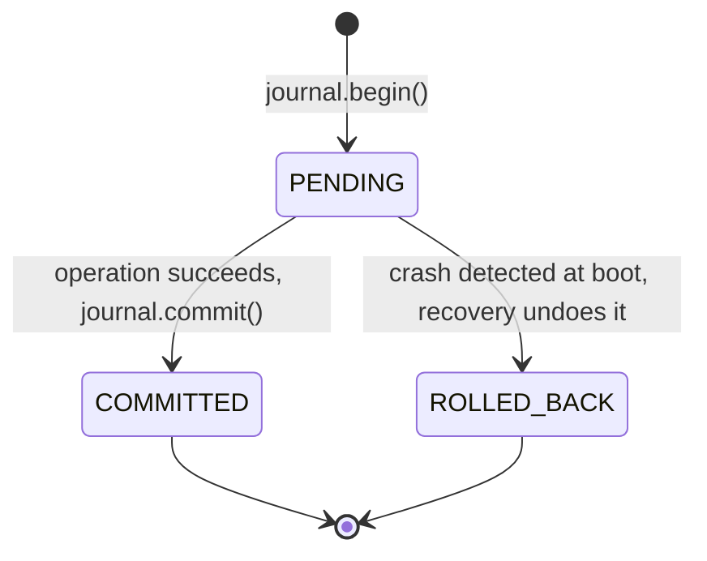
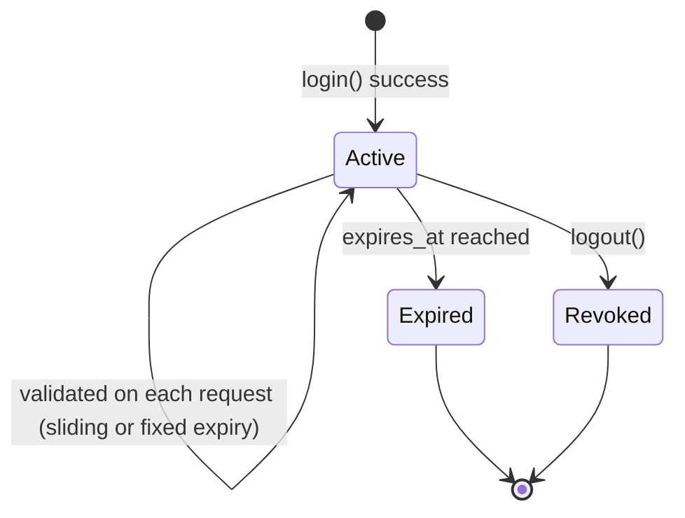

# SmartFS — Detailed Design

This document goes one level below `architecture.md`: concrete data structure
layouts, algorithms, state machines, and the design patterns that make the four
modules composable. Treat the structs below as the **contract** — field names
and types should not change without updating `function.md` and notifying every
module owner (see `workflow.md §5`).

## 1. Design Principles

1. **Layer isolation** — a module may only call the API another module exposes
   (`function.md`), never reach into its internal structures.
2. **Fail closed** — every check (auth, RBAC, quota, permission bits) defaults
   to deny; the "allow" path must be explicit.
3. **Durability before mutation** — nothing physically changes on disk before
   the journal has a durable record of the intent (see `architecture.md §9`).
4. **Observability is free** — metrics emission must never be able to raise an
   exception that aborts a file operation; it is best-effort and async.
5. **Two allocation strategies, one interface** — FAT and Inode modes must be
   interchangeable behind the same `StorageEngine` interface so the rest of the
   system never branches on allocation mode.

## 2. Core Data Structures

Field sizes assume a 4 KB block and a 64 MB disk image (16,384 blocks) as the
default config; both are configurable at format-time.

### 2.1 Superblock (Layer 5)

```python
class Superblock:
    magic: bytes          # 4 bytes, e.g. b"SMFS" — sanity check on mount
    disk_size: int        # total bytes
    block_size: int       # bytes per block (default 4096)
    total_blocks: int
    free_blocks: int
    allocation_mode: str  # "FAT" | "INODE"
    root_dir_ptr: int     # block/inode number of root directory
    fs_version: int       # on-disk format version, for future migrations
```

### 2.2 Free-Block Bitmap

```python
class FreeBitmap:
    bits: bytearray        # 1 bit per block; 0 = free, 1 = allocated
    def is_free(self, block_id: int) -> bool: ...
    def mark(self, block_id: int, allocated: bool) -> None: ...
    def find_free_run(self, n: int) -> list[int] | None:
        """Contiguous-first search for defrag/contiguous allocation; falls
        back to scattered free blocks if no run of length n exists."""
```

### 2.3 FAT Table (FAT mode)

```python
FAT_EOF = -1
FAT_FREE = 0

class FatTable:
    entries: list[int]     # entries[i] = next block in chain, or FAT_EOF/FAT_FREE
    def chain(self, start: int) -> list[int]:
        """Walk entries from start until FAT_EOF; used by read/defrag."""
    def link(self, prev: int, nxt: int) -> None: ...
    def free_chain(self, start: int) -> list[int]:
        """Returns freed block ids for the bitmap to clear."""
```

### 2.4 Inode Table (Inode mode)

```python
class Inode:
    inode_id: int
    owner_uid: int
    group_gid: int
    perm_bits: int          # rwxrwxrwx as 9 bits, Unix-style
    size_bytes: int
    ctime: float
    mtime: float
    direct_blocks: list[int]     # e.g. 12 direct pointers
    indirect_block: int | None   # points to a block full of block ids
    double_indirect: int | None  # for very large files (optional/advanced)

class InodeTable:
    inodes: dict[int, Inode]
    def allocate_inode(self) -> Inode: ...
    def free_inode(self, inode_id: int) -> list[int]:
        """Frees the inode and returns all block ids it owned."""
```

### 2.5 Directory Entry

```python
class DirEntry:
    name: str
    entry_type: str       # "file" | "dir"
    target: int           # inode_id (INODE mode) or starting cluster (FAT mode)
    parent: int            # parent directory's inode/cluster id

class Directory:
    entries: dict[str, DirEntry]
    def resolve_path(self, path: str) -> DirEntry | None:
        """Splits on '/', walks each component; returns None -> ENOENT."""
```

### 2.6 Journal Record (Write-Ahead Log)

```python
class JournalStatus(Enum):
    PENDING = "PENDING"
    COMMITTED = "COMMITTED"
    ROLLED_BACK = "ROLLED_BACK"

class JournalRecord:
    txn_id: int
    op_type: str            # "WRITE" | "DELETE" | "MKDIR" | "DEFRAG" | ...
    target: str              # file/dir path or inode id
    old_state: dict | None   # sufficient to undo (e.g. prior bitmap/FAT slice)
    new_state: dict           # sufficient to redo/verify
    status: JournalStatus
    timestamp: float
```

The journal is **append-only**; a record is never edited in place — a status
change is itself a new appended record referencing `txn_id`. This makes replay
order-independent and crash-safe at the log-write level too.

### 2.7 Version Store

```python
class VersionEntry:
    version_id: int
    file_path: str
    timestamp: float
    block_map: list[int] | None   # full snapshot: list of block ids
    diff: bytes | None             # OR a diff against the previous version

class VersionStore:
    versions: dict[str, list[VersionEntry]]   # keyed by file_path
    def snapshot(self, file_path: str, blocks: list[int]) -> VersionEntry: ...
    def restore(self, file_path: str, version_id: int) -> list[int]: ...
```

**Chosen strategy:** full block-map snapshots for the first implementation
(simpler, easier to verify in tests), with diff-based storage documented as a
stretch goal once snapshot-based versioning is proven correct. Do not attempt
diff-based versioning before snapshot-based versioning has passing tests — see
`mistake.md §4`.

### 2.8 Cache Entry (LRU)

```python
class CacheEntry:
    block_id: int
    data: bytes
    dirty: bool

class LRUCache:
    capacity: int
    map: dict[int, Node]          # block_id -> doubly-linked-list node
    order: DoublyLinkedList        # most-recently-used at head
    hits: int
    misses: int

    def get(self, block_id: int) -> bytes | None: ...
    def put(self, block_id: int, data: bytes) -> None: ...
    def evict(self) -> CacheEntry:
        """Removes and returns the tail (least-recently-used) entry."""
    @property
    def hit_ratio(self) -> float: ...
```

Implementation: `dict` + doubly linked list gives O(1) `get`/`put`/`evict` —
this is the textbook LRU shape and the one to implement; do not use a plain
list with linear scan for "simplicity" (see `mistake.md §4`).

### 2.9 User & Session (Security)

```python
class User:
    uid: int
    username: str
    password_hash: bytes
    salt: bytes
    role: str              # "admin" | "standard" | "guest"

class Session:
    token: str
    uid: int
    created_at: float
    expires_at: float
```

### 2.10 Quota Record

```python
class QuotaRecord:
    uid: int
    limit_bytes: int
    used_bytes: int
    def would_exceed(self, incoming_bytes: int) -> bool:
        return self.used_bytes + incoming_bytes > self.limit_bytes
```

## 3. Algorithms

### 3.1 FAT Allocation

```
allocate_chain(n_blocks):
    chain = []
    for i in range(n_blocks):
        free = bitmap.find_first_free()
        if free is None: raise DiskFullError
        bitmap.mark(free, allocated=True)
        chain.append(free)
    for i in range(len(chain) - 1):
        fat.link(chain[i], chain[i+1])
    fat.link(chain[-1], FAT_EOF)
    return chain[0]   # starting cluster
```

### 3.2 Inode Allocation

```
allocate_for_inode(inode, n_blocks):
    for i in range(n_blocks):
        free = bitmap.find_first_free()
        if free is None: raise DiskFullError
        bitmap.mark(free, allocated=True)
        if len(inode.direct_blocks) < DIRECT_LIMIT:
            inode.direct_blocks.append(free)
        else:
            append_to_indirect(inode, free)   # allocate indirect block on first overflow
```

### 3.3 Block Allocation Strategies (comparative, per project plan)

| Strategy | Allocation rule | Fragmentation behavior |
|---|---|---|
| Contiguous | `bitmap.find_free_run(n)` | Fast sequential read; fragments badly under repeated grow/shrink |
| Linked (FAT-style) | One free block at a time, linked via FAT | No external fragmentation of the *bitmap*, but chains scatter across disk → poor sequential read locality |
| Indexed (Inode-style) | Direct + indirect pointers to scattered blocks | Fast random access to any block; indirect block itself is overhead for small files |

Expose all three behind one `allocate(n_blocks, strategy)` entry point so the
report's comparative analysis (project plan §4 deliverable) is generated from
one benchmark harness, not three separate ad hoc scripts.

### 3.4 Defragmentation

```
defragment(file):
    chain = get_block_chain(file)
    if is_contiguous(chain): return NO_OP
    txn = journal.begin("DEFRAG", file, old_state=chain)
    data = read_blocks(chain)
    new_chain = bitmap.find_free_run(len(chain)) or allocate_scattered(len(chain))
    write_blocks(new_chain, data)
    update_pointers(file, new_chain)   # FAT relink or inode pointer rewrite
    free_blocks(chain)                  # old blocks -> bitmap cleared
    journal.commit(txn, new_state=new_chain)
```

### 3.5 Crash Recovery (Undo Logging)

```
recover():
    for record in journal.scan_ordered():
        if record.status == COMMITTED:
            assert on_disk_matches(record.new_state), "corruption: re-run fsck-equivalent"
            continue
        if record.status == PENDING:
            restore(record.old_state)
            journal.append(record.txn_id, status=ROLLED_BACK)
    bitmap_fat_consistency_check()
    reclaim_orphaned_blocks()
    emit_recovery_report()
```

### 3.6 Crash Injection (Test Harness Design)

To make Pipeline C testable, the write path must accept an injectable failure
point:

```python
def write_file(..., _fail_after: str | None = None):
    journal.begin(...)
    if _fail_after == "journal": os._exit(1)     # simulate crash
    compress(...)
    encrypt(...)
    allocate(...)
    if _fail_after == "allocate": os._exit(1)
    physical_write(...)
    journal.commit(...)
```

This lets `tests/crash_injection` deterministically kill the process at every
named stage and assert recovery restores a consistent state — see
`workflow.md §6`.

## 4. State Machines

### 4.1 Journal Record Lifecycle



A record must never transition `COMMITTED -> PENDING` or be mutated after
`COMMITTED`/`ROLLED_BACK` — the log is append-only (§2.6).

### 4.2 Session Lifecycle



## 5. Reliability Design Decisions

| Decision | Choice | Rejected alternative | Why |
|---|---|---|---|
| Logging strategy | Undo (rollback) logging | Redo logging | Simpler correctness argument for a semester timeline; client never saw success for an in-flight write, so losing it is safe |
| Versioning storage | Full snapshots | Byte-level diffs | Snapshots are trivial to verify correct in tests; diffs are a stretch goal after snapshots pass |
| Cache eviction | Strict LRU | LFU / random | LRU is the one the project plan and grading rubric expect, and it directly supports the hit-ratio metric story |
| Compression algorithm | `zlib` (DEFLATE) | Custom RLE | Correctness and speed both matter more than a hand-rolled algorithm here; zlib is stdlib and well-tested |

## 6. Security Design Decisions

- **Password storage:** `bcrypt` (or PBKDF2-HMAC-SHA256 with ≥100k iterations
  and a unique per-user salt) — never plain SHA-256 alone, and never a global
  salt (see `mistake.md §3`).
- **Session tokens:** cryptographically random (`secrets.token_urlsafe(32)`),
  stored server-side keyed by token, with a fixed expiry (e.g. 30 min) checked
  on *every* request, not just at login.
- **RBAC matrix:**

  | Role | Read own | Write own | Read others | Write others | Admin ops |
  |---|---|---|---|---|---|
  | Admin | ✓ | ✓ | ✓ | ✓ | ✓ |
  | Standard | ✓ | ✓ | only if perm bits allow | only if perm bits allow | ✗ |
  | Guest | ✓ (if world-readable) | ✗ | ✓ (if world-readable) | ✗ | ✗ |

  RBAC and permission bits are **both** checked — RBAC answers "can this role
  ever do this kind of operation," permission bits answer "does this specific
  file allow it for this specific user." Passing one does not skip the other.
- **Encryption key management:** one key per file, derived via HKDF from a
  per-user master key + file id; master key is derived from the user's
  password at login and held only in memory for the session (documented
  limitation: the simulator does not implement a hardware key vault — this is
  explicitly out of scope, and the report should say so rather than imply
  production-grade key custody).
- **Audit log:** every access attempt (success and failure) is appended with
  `{uid, op, target, result, timestamp}` — this feeds both the security demo
  and the M4 dashboard's access-log panel.

## 7. Analytics/Quota Design

- **Quota check** is a pure function of `QuotaRecord` and the incoming size —
  it must run *before* any journal entry is created (architecture.md §9).
- **Metrics are pushed via an event bus**, not polled: each module calls
  `metrics.emit(event_type, payload)`; the dashboard subscribes. This keeps
  Layer 6 decoupled and non-blocking (a slow dashboard render must never slow
  down a write).
- **Dashboard panels** map directly to emitted event types:

  | Panel | Event source |
  |---|---|
  | Disk usage | Superblock free/total blocks, on every allocate/free |
  | Fragmentation % | Defragmenter scan (Pipeline D step 2) |
  | Cache hit ratio | `LRUCache.hit_ratio`, on every get |
  | Quota per user | `QuotaRecord`, on every write |
  | Access log | Audit log entries (M2) |
  | Journal/recovery events | Every journal status transition + recovery report |

## 8. Design Patterns Applied

| Pattern | Where | Why |
|---|---|---|
| **Strategy** | Allocation mode (FAT vs Inode), block allocation (contiguous/linked/indexed) | Swap algorithms behind one interface without touching callers |
| **Observer** | Metrics emission → dashboard subscribers | Decouples emitters from the dashboard; supports multiple subscribers later (log file + web UI) |
| **Command** | Journal records | Each record *is* an undoable command object (`old_state`/`new_state`) |
| **Facade** | The Layer 3 File System API | Single entry point hides the M1/M2/M3/M4 orchestration from the UI |
| **Singleton (scoped)** | Virtual disk handle, journal log handle | Exactly one process should hold the open file handle to `disk.img` at a time |
| **Chain of Responsibility** | The write pipeline itself (auth → quota → journal → compress → encrypt → allocate) | Each stage can short-circuit (reject) without the next stage needing to know why |

## 9. Module Interface Contracts (Summary)

Full signatures are in `function.md`. The contracts below are what must be
agreed **in Phase 1** (project plan, weeks 1–2) before parallel build begins:

| Interface | Exposed by | Consumed by |
|---|---|---|
| `allocate_block`, `free_block`, `create_file`, `read_file`, `write_file`, `mkdir`, `resolve_path` | M1 | M4 (API layer), M3 (via M4) |
| `authenticate`, `check_rbac`, `check_permission_bits`, `encrypt_data`, `decrypt_data` | M2 | M4 (API layer) |
| `journal_write_intent`, `journal_commit`, `cache_get`, `cache_put`, `compress_block`, `decompress_block`, `create_version` | M3 | M1 (write/read path), M4 (orchestration) |
| `check_quota`, `update_usage`, `emit_metric` | M4 | M1, M2, M3 (all emit through this) |

Changing any signature here after Phase 2 begins requires a version bump and a
note in the weekly sync (see `workflow.md §5`) — never a silent edit.
